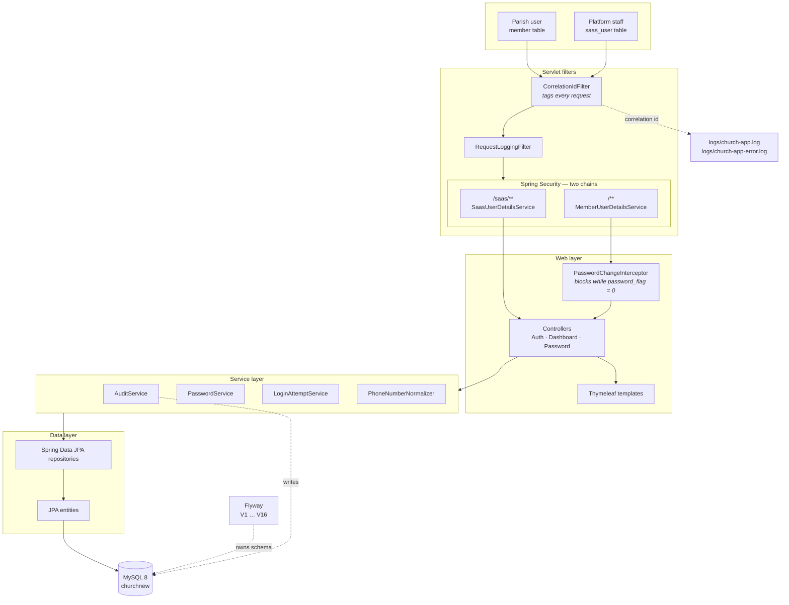
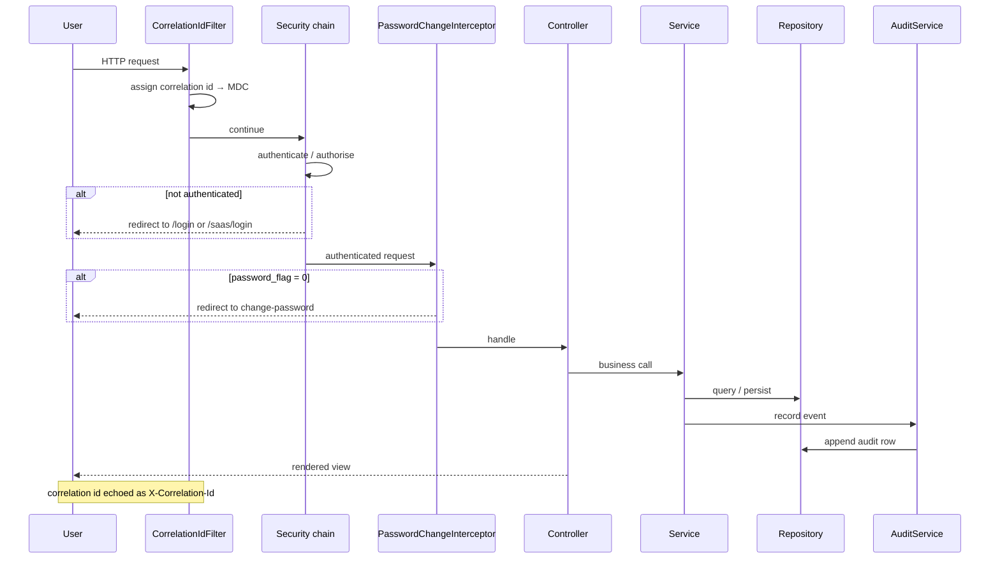

# Architecture

## Overview

## Layering

The rule is `controller → service → repository`, and nothing skips a layer. Controllers
never touch repositories directly.

That discipline is what will make auditing cheap to extend: because every write goes
through a service, there is a single seam to hook into. Scattered repository calls in
controllers would mean hand-writing audit calls in dozens of places and missing some.

| Package | Holds |
|---|---|
| `controller` | Request handling and view selection only |
| `service` | Business rules, transactions, audit calls |
| `repository` | Spring Data JPA interfaces |
| `entity` | JPA entities and domain enums |
| `security` | Principals, `UserDetailsService`s, auth handlers, interceptor |
| `config` | Security config, MVC config, `@ConfigurationProperties` |
| `filter` | Correlation id, request logging |
| `exception` | Exception hierarchy and the global handler |
| `dto` | Form and response objects |

## Request flow

## Cross-cutting concerns

**Correlation IDs.** Every request gets an id, held in the SLF4J MDC, echoed in the
`X-Correlation-Id` response header, printed on every log line, stored on every audit row,
and shown to users on error pages as a "Reference". A user reporting a problem can quote
it, and it leads straight to the exact log lines and audit entries.

**Error handling.** One `@ControllerAdvice` serves HTML to browsers and JSON to API/AJAX
callers from the same handlers. 4xx are logged at WARN without stack traces; 5xx at ERROR
with the full trace, while the user sees only a generic message and the reference.

**Logging.** Console plus two rolling files (all events, and errors only). File writes go
through an async appender with `neverBlock`, so logging can never stall a request.

## Technology

| Choice | Version | Note |
|---|---|---|
| Spring Boot | 4.1.0 | Starters renamed from Boot 3 — `spring-boot-starter-webmvc`, not `-web` |
| Java | 17 | |
| Gradle | 9.5.1 | via wrapper |
| MySQL | 8.0.45 | utf8mb4 throughout, for Tamil script |
| Flyway | V1–V16 | Baselined over pre-existing tables |
| Thymeleaf | | Server-rendered; no JS framework |

**No inline JavaScript.** The CSP sets `script-src 'self'`, so scripts live in
`/static/js/`. This is why the password show/hide control is a separate file.
