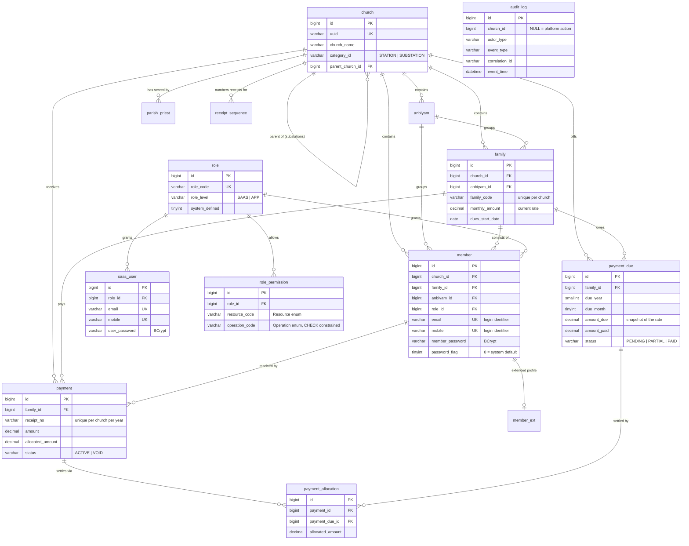

# Database schema

MySQL 8, schema `churchnew`, `utf8mb4 / utf8mb4_unicode_ci` throughout — Anbiyam and
member names are stored in Tamil script.

Schema is owned by **Flyway** (V1–V24). Hibernate runs with `ddl-auto: validate`, so the
application refuses to start if an entity and its table have drifted apart.

## What V17–V24 changed

| | |
|---|---|
| **V17** | Dropped `church.category_id`. A substation is one **because it has a parent**, not because a column says so — and the two had already disagreed |
| **V18** | *(seed)* One real substation, so the parent/child structure can be seen |
| **V19** | `parish_priest` gains `clergy_role`, `deleted_flag`, `version`; `to_date` becomes nullable and **NULL now means currently serving**; `active_flag` was used once to identify who was serving, then dropped |
| **V20** | Seeds `PARISH_PRIEST` permissions — VIEW for every role, ADD/EDIT for the two platform admins, DELETE for the super admin |
| **V21** | `member.catagory` → `member.family_role`, holding a `FamilyRole` |
| **V22** | *(seed)* Corrects those values by hand. Occupations moved to `member_ext.occupation`; ANIMATOR and PRIEST were already recorded properly elsewhere |
| **V23** | Grants `AppUser` `PAYMENT ADD` — a volunteer collects and prints but can never edit or void what they recorded |
| **V24** | `payment_due.due_type` — MONTHLY or OPENING_BALANCE, so arrears carried in at cutover can be told apart from being behind this year |

> Apply schema changes as migrations, never directly to the database. V16 exists solely to
> repair a constraint that was added by hand, which left the migration history describing
> a schema that no longer matched reality.

## Entity relationships

## Tenant isolation

Every church-scoped table carries `church_id NOT NULL` with a foreign key to `church`:

`member` · `member_ext` · `family` · `anbiyam` · `parish_priest` · `payment` ·
`payment_due` · `payment_allocation` · `receipt_sequence`

Five tables have no `church_id`, each deliberately:

| Table | Why |
|---|---|
| `church` | It *is* the tenant |
| `role`, `role_permission` | Platform-wide reference data, shared by every parish |
| `saas_user` | Platform accounts, which reach every church by design |
| `audit_log` | `church_id` is **nullable** — NULL marks a platform-level action. No FK either, so audit rows outlive the records they describe |

> ### ⚠ Isolation is not yet enforced
>
> The columns are correct, but **no query applies them automatically.** Every repository
> inherits `findAll()`, `findById()` and `count()` from `JpaRepository`, none of which
> filter by church. `AppUserPrincipal.getChurchId()` is populated at sign-in but nothing
> reads it.
>
> Today, isolation depends on every future query remembering to filter. One forgotten
> `findAll()` leaks another parish's members, phone numbers and contribution history.
>
> The intended fix is a Hibernate `@Filter` enabled per request from the principal, so
> scoping happens at the ORM level and cannot be forgotten.

## Column conventions

Most tables follow a consistent shape:

| Column | Purpose |
|---|---|
| `id` | `BIGINT AUTO_INCREMENT` surrogate key |
| `uuid` | `VARCHAR(36)` unique — stable external identifier |
| `record_status` | `ACTIVE` / `INACTIVE` |
| `deleted_flag` | Soft delete |
| `version` | Optimistic locking (`@Version`) |
| `create_date`, `created_user`, `last_updated_date`, `updated_user` | Audit columns |

`create_date` defaults to `CURRENT_TIMESTAMP` and is mapped read-only.
`last_updated_date` has **no** `ON UPDATE` clause, so the application must set it.

### Known inconsistencies

Not every table follows the convention. These are recorded rather than silently tolerated:

| Table | Deviation | Deliberate? |
|---|---|---|
| `audit_log` | No `version`, `deleted_flag`, `record_status` or `updated_*` | **Yes** — append-only. An audit row that can be edited proves nothing |
| `role_permission` | No `deleted_flag` | **Yes** — revoking hard-deletes. A soft-deleted row would still occupy the unique key, so re-granting the same permission later would fail |
| `payment_allocation`, `receipt_sequence` | No `record_status`, `deleted_flag`, `version` | Yes — internal bookkeeping |
| `anbiyam` | No `version` | **Inherited** — pre-existing table, no optimistic locking |
| `parish_priest` | No `record_status` | Inherited. `deleted_flag` and `version` were added by V19 when the table was finally mapped |
| ~~`member.catagory`~~ | ~~Misspelled column name~~ | **Fixed.** V21 renamed it `family_role`; V22 replaced its contents, which had held parish duties and occupations rather than family positions |
| `member_ext.family_id` | No foreign key | **No** — `church_id` and `member_id` are FK'd but `family_id` is not |
| `family.head_member_id` | No foreign key | **Yes** — `member.family_id` is NOT NULL, so a two-way FK would be circular and neither row could be inserted first |
| `anbiyam.head_member_id` | *Has* an FK | Inconsistent with `family.head_member_id` above |

## Constraints worth knowing

| Constraint | Effect |
|---|---|
| `member.uk_member_email`, `uk_member_mobile` | Login identifiers are unique. MySQL allows unlimited NULLs, so members with no contact details coexist — they simply cannot sign in |
| `family.uk_family_code_church` | `(church_id, family_code)` — each parish numbers its own register from 1 |
| `payment.uk_payment_receipt` | `(church_id, receipt_year, receipt_no)` — receipt books are per parish, per year |
| `payment_due.uk_payment_due_family_period` | `(family_id, due_year, due_month)` — makes "generate dues" safe to run twice |
| `payment_due.ck_payment_due_not_overpaid` | `amount_paid <= amount_due` |
| `role_permission.ck_role_permission_operation` | `operation_code` must be one of the six `Operation` values |
| `member_ext.uk_member_ext_member` | One extended profile per member |

Mobile numbers are stored in canonical international form (`+919840100001`).
Without that, the unique index is only half-effective: `+919840100001` and `9840100001`
are different strings, so one phone could be registered against two members.

## Migration history

| Version | Change |
|---|---|
| 1 | Baseline — five tables created outside Flyway (`church`, `member`, `member_ext`, `anbiyam`, `parish_priest`) |
| 2–5 | `role`, `family`, `saas_user`; login columns added to `member` |
| 6–7 | Six roles seeded; **sample data** |
| 8 | Address columns dropped from `family` (they live on `member_ext`) |
| 9–11 | `role_permission`; church categories normalised; 275 permission rows seeded |
| 12 | `audit_log` |
| 13–14 | Payment tables; **sample payment data** |
| 15 | Mobile numbers canonicalised |
| 16 | Unique index on `member_ext.member_id` (conditional — repairs a manual change) |

> ### ⚠ V7 and V14 are development sample data
>
> They insert three fictional churches, eleven members and their receipts. Running these
> migrations against production would load all of it. The fix is profile-specific
> `spring.flyway.locations`, separating seed data from schema.
