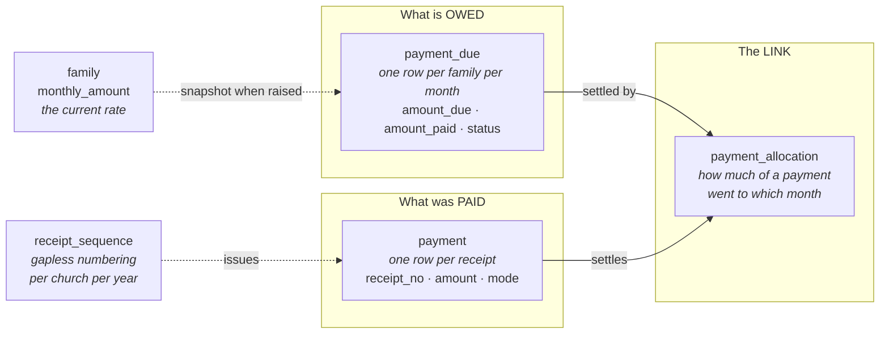

# Monthly contributions

Each family agrees a monthly amount and pays it over time. Three awkward realities drive
the design:

1. A family pays **several months at once** — ₹500 covering January, February and March
2. A family pays **part of a month** — ₹100 against a ₹200 month, topped up later
3. The parish needs **arrears per family and per month**, in money and in months

## Why three tables



**A payments-only table cannot answer "who is behind".** A family that paid nothing has no
payment row — there is nothing to query. Arrears are about what *didn't* happen, and
absence is not something you can `SELECT`. `payment_due` supplies the list of expectations
to compare against.

**The allocation table exists because the relationship is genuinely many-to-many.** One
payment covers many months; one month is settled by many payments. Neither direction fits
as a column on the other side.

**`amount_due` is a snapshot, not a reference.** `family.monthly_amount` holds the *current*
rate; each due row copies the rate in force when it was raised. So raising a family from
₹200 to ₹300 affects future months only — past arrears are never retrospectively rewritten,
and a family is never chased for money it never owed.

## Worked example

Arulraj family, ₹200/month, nothing paid since January. On 15 March they hand over ₹500.

```
payment  R-2026-0001   15 Mar   ₹500  CASH
   │
   ├── payment_allocation → January 2026   ₹200   → PAID
   ├── payment_allocation → February 2026  ₹200   → PAID
   └── payment_allocation → March 2026     ₹100   → PARTIAL  (₹100 still owed)
```

One receipt, three months, the last one partial — and the receipt prints exactly those
three lines with their months.

## The two reports

**Arrears per family**

```sql
SELECT f.family_code, f.family_name,
       COUNT(*)                            AS pending_months,
       SUM(pd.amount_due - pd.amount_paid) AS pending_amount
FROM payment_due pd JOIN family f ON f.id = pd.family_id
WHERE pd.church_id = ? AND pd.status <> 'PAID' AND pd.deleted_flag = 0
GROUP BY f.id ORDER BY pending_amount DESC;
```

**Month by month across the parish**

```sql
SELECT due_year, due_month,
       SUM(amount_due)                 AS billed,
       SUM(amount_paid)                AS collected,
       SUM(amount_due - amount_paid)   AS pending
FROM payment_due WHERE church_id = ?
GROUP BY due_year, due_month ORDER BY due_year, due_month;
```

Both are also available as repository methods returning projections
(`FamilyArrears`, `MonthlyCollection`).

## Rules the database enforces

| Rule | Constraint |
|---|---|
| A month can never be paid more than it owes | `amount_paid <= amount_due` |
| A receipt cannot allocate more than was handed over | `allocated_amount <= amount` |
| Amounts are positive | `amount > 0`, `allocated_amount > 0` |
| Months are 1–12 | `due_month BETWEEN 1 AND 12` |
| Payment modes are known values | `CASH, UPI, CHEQUE, BANK_TRANSFER, CARD, OTHER` |
| Generating dues twice is harmless | `UNIQUE (family_id, due_year, due_month)` |
| Receipt numbers are unique per parish per year | `UNIQUE (church_id, receipt_year, receipt_no)` |

**The central invariant:** a due's `amount_paid` always equals the sum of its allocations.

All money is `DECIMAL(12,2)` — never floating point.

## Receipt numbering

Not `AUTO_INCREMENT`: that is global rather than per-church and leaves gaps whenever a
transaction rolls back. A parish auditor asking why receipt 41 is missing is a conversation
worth avoiding.

`receipt_sequence` holds a counter per church per year, read with a **pessimistic row lock**
while a receipt is issued, so two secretaries saving at the same instant cannot be handed
the same number. Numbering resets every January. Format: `R-2026-0042`.

Both St. Mary's and St. Joseph's hold their own `R-2026-0001` — receipt books are
per-parish.

## Voiding

A mistaken receipt is **never deleted**. It gets `status = VOID`, its allocations are
removed and the dues restored, while the original stays visible. A parish cash book with
rows silently removed is not a cash book. What the receipt used to cover is preserved in
`audit_log`.

Voided receipts are excluded from collection totals but remain in the record.

## Advance payments

A payment may exceed what is currently owed. The surplus is
`amount - allocated_amount` — advance credit, applied when future months are raised.
`PaymentRepository.findWithUnallocatedAmount` lists receipts holding one.

## Opening balances

A parish adopting this already has families who owe money, sometimes years of it.
Reconstructing that month by month would mean inventing amounts nobody charged, so each
family instead gets **one line**: everything owed before the system started.

It is dated the **month before that family's `dues_start_date`** — a slot no generated
month can occupy, so the unique key needs no relaxing and the row sorts first for
oldest-first allocation. Which is exactly where arrears carried forward belong.

`due_type` (V24) tells it apart from an ordinary month, so a summary can separate "behind
this year" from "brought in from the old book".

The figure is editable until money lands on it, then locked: rewriting an amount a receipt
was written against would leave the parish's books disagreeing with the family's paper. A
family in **credit** is not a negative here — that is recorded as a payment.

## Correcting a mistake

A receipt is never edited and never deleted. **Void and reissue:**

1. The original is marked VOID with a reason and a name; its allocations are reversed and
   the months restored
2. A corrected receipt is issued, and the two are cross-referenced — the old one records
   "replaced by R-2026-0004", the new one "replaces R-2026-0003"
3. **The number stays consumed.** A gap in a receipt book cannot be told apart from a
   covered-up shortfall, which is the only reason to number gaplessly in the first place

Why not simply edit the amount: the family is holding a printed slip. Change the record
behind it and the parish's books disagree with the only evidence they have.

## Dating a receipt

Today by default. **A past date requires `PAYMENT EDIT`** — a parish collecting on Sunday
and entering on Monday needs it, but a volunteer should not be choosing what day they took
cash. **A future date is refused for everyone**: there is no honest reason to write one,
and it is how money leaves a period about to be counted.

## When a family's amount changes

Months still **PENDING** from the current one onward take the new figure. **PAID** and
**PARTIAL** months are left alone — they were settled against an amount the family has a
receipt for. The screen reports what it did rather than changing debts silently.

The ₹50 floor from `app.payment.min-monthly-amount` is enforced here, and the change is
audited with the old and new values.

## Printing

A page of its own rather than a print stylesheet over the receipt screen, so what reaches
the printer is exactly what is on it. 58mm wide, bilingual, listing the months settled so a
family can check their own arrears, with the amount written out in **lakh and crore** —
not millions.

**On Tamil and thermal printers:** the browser renders the page and sends it through the
printer's own driver as graphics, so the script prints. The built-in character set that
cannot render Tamil only applies to raw ESC/POS text, which this never sends. Testing
without a printer: print to PDF at a custom 58mm width — the same stylesheet drives both.

## Not yet built

- **Reports** — daily collection, arrears by family, family statement. The aggregate
  queries exist (`findArrearsByChurch`, `findMonthlySummaryByChurch`) and are unused
- **Bulk import of historical receipts**, for a parish whose old records are good enough
- **Printing from a phone to a USB thermal printer** — not possible from a browser; it
  needs a Bluetooth printer or a PDF handed to the operating system
