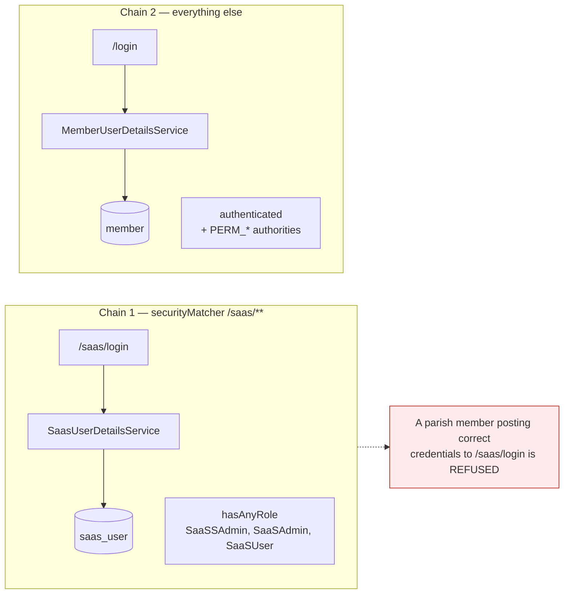
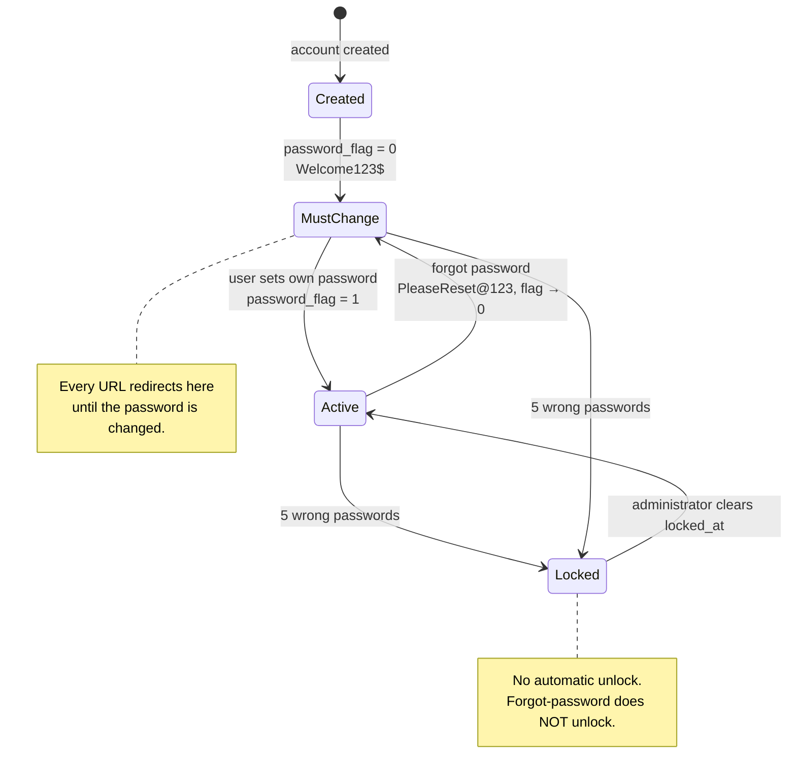

# Security

## Two login systems, one application

Parish accounts live in `member`; platform accounts live in `saas_user`. Rather than one
form searching both tables and guessing, each has its own Spring Security filter chain
with its own `UserDetailsService`.



**The separation is real, not cosmetic.** A parishioner posting a correct password to
`/saas/login` fails, because that chain's service never reads the `member` table. The
distinct URL is for clarity and policy — never concealment. Every protected page still
carries a server-side authority check.

Verified both directions: parish member at `/saas/login` → rejected; platform user at
`/login` → rejected.

## Login identity

Users sign in with **either their email address or their mobile number**. Both are unique
where present; members with neither cannot sign in at all, which is intended.

Mobile numbers are normalised before lookup, so all of these reach the same account:

```
9840100001 · 919840100001 · 09840100001 · 98401 00001 · 98401-00001 · +919840100001
```

A number typed with an explicit `+` is honoured untouched, so overseas numbers
(`+49…`, `+44…`, `+1…`) are never mangled by the default country code. The default lives
in `app.security.default-country-code`, so deploying for another country is a one-line
change.

## Password lifecycle



**Forced first change.** While `password_flag = 0`, `PasswordChangeInterceptor` redirects
every request to the change-password page. Redirecting once at login would not be enough —
a user could simply type another URL.

**Forgot password** resets to `app.security.reset-password` and returns the flag to 0. The
confirmation message is identical whether or not the account exists, so the form cannot be
used to discover which numbers belong to real parishioners.

> **Known weakness, accepted by decision.** Resetting to a *known shared* password means
> anyone who can submit a parishioner's mobile number can set that account to a value they
> know. Rate limiting (3 per account per hour, counted from the audit log) reduces but does
> not remove this. A random one-time password per reset would close it, at no extra
> complexity.

**Rejected new passwords.** There is no complexity policy, but the new password may not be
either system default — otherwise `password_flag = 1` would stop meaning "the user chose
this".

## Lockout

Five consecutive wrong passwords lock the account. There is **no automatic expiry**: an
administrator must clear it.

```sql
UPDATE member SET locked_at = NULL, failed_attempt_count = 0 WHERE email = 'someone@example.com';
```

Implementation points that matter:

- The counter is a **single atomic `UPDATE`**, not read-then-write. Five simultaneous wrong
  guesses would each read `4` and each write `5`, and the account would never lock.
- `LoginAttemptService` runs `REQUIRES_NEW`. The failure handler fires *after* the
  authentication attempt has rolled back; joining that transaction would roll the increment
  back with it.
- Only a wrong password counts. An unknown identifier has no account to count against, and
  an already-locked account is not counted again.

A locked user **is told** they are locked and pointed at the parish office. This is a
deliberate trade-off: it confirms to an attacker that they succeeded, but the alternative
leaves a genuine parishioner retrying forever with no explanation.

## Authorisation — dynamic RBAC

The **vocabulary** is code; the **mapping** is data.

- `Operation` enum — `ADD`, `VIEW`, `EDIT`, `DELETE`, `ACTIVATE_DEACTIVATE`, `EXPORT`
- `Resource` enum — `CHURCH`, `USER`, `ROLE`, `MEMBER`, `FAMILY`, `ANBIYAM`,
  `ANBIYAM_MAPPING`, `PAYMENT`, `DASHBOARD`, `REPORT`, `AUDIT`
- `role_permission` table — which role may do what

A new operation needs a code change anyway, so it belongs in an enum. *Who may do what*
must be changeable without a redeploy, so it belongs in rows. Changing the matrix is an
`INSERT`/`DELETE` — no migration, no restart.

At sign-in, permissions become authorities of the form `PERM_MEMBER_EDIT`, alongside
`ROLE_AppSA`.

| Role | ADD | VIEW | EDIT | DELETE | ACT/DEACT | EXPORT |
|---|:--:|:--:|:--:|:--:|:--:|:--:|
| SaaSSAdmin | ✓ | ✓ | ✓ | ✓ | ✓ | ✓ |
| SaaSAdmin | ✓ | ✓ | ✓ | — | ✓ | ✓ |
| SaaSUser | — | ✓ | — | — | — | ✓ |
| AppSA | ✓ | ✓ | ✓ | ✓ | ✓ | ✓ |
| AppAdmin | ✓ | ✓ | ✓ | — | ✓ | ✓ |
| AppUser | — | ✓ | — | — | — | — |

275 rows across 11 resources. SaaS and App roles share an operation set on purpose — what
separates them is the *breadth of data* they reach, enforced by tenant filtering rather
than by this matrix.

`AppUser` deliberately has no `EXPORT`: a read-only parish account should not be able to
extract a member list complete with phone numbers and addresses.

## Session and transport hardening

| Control | Setting |
|---|---|
| CSRF | Enabled. Thymeleaf adds the token to any `th:action` form; logout is POST-only |
| Password hashing | BCrypt, strength 12 |
| Session fixation | New session on login |
| Concurrent sessions | One per user — signing in elsewhere ends the older session |
| Session timeout | 30 minutes |
| `X-Frame-Options` | `DENY` |
| `X-Content-Type-Options` | `nosniff` |
| `Referrer-Policy` | `same-origin` |
| CSP | `default-src 'self'` — no inline script, no CDN |
| HSTS | Configured; emitted only over HTTPS |

## Audit trail

Append-only. No foreign keys, so rows outlive the records they describe — deleting a member
must not erase the evidence of what they did.

Security events (`LOGIN_SUCCESS`, `LOGIN_FAILURE`, `ACCOUNT_LOCKED`, `PASSWORD_CHANGED`,
`PASSWORD_RESET`, …) commit in **their own transaction**, so they survive whatever the
failed request rolled back — precisely the events an attacker would most want erased.

Every row carries the request's correlation id, so an audit entry leads straight to its
application log lines.

## Sample accounts

All use the password `Welcome123$` with `password_flag = 0`.

**Platform** → `/saas/login`

| Role | Email | Mobile |
|---|---|---|
| SaaSSAdmin | `superadmin@churchapp.local` | `9000000001` |
| SaaSAdmin | `admin@churchapp.local` | `9000000002` |
| SaaSUser | `support@churchapp.local` | `9000000003` |

**Parish** → `/login`

| Church | Role | Email |
|---|---|---|
| St. Mary's, Chennai | AppSA | `antony.raj@stmarys-chennai.org` |
| St. Mary's, Chennai | AppAdmin | `mary.arulraj@example.com` |
| St. Mary's, Chennai | AppUser | `stephen.d@example.com` |
| St. Joseph's, Madurai | AppSA | `xavier.britto@stjosephs-madurai.org` |
| Our Lady of Lourdes, Trichy | AppSA | `sebastian.rayan@lourdes-trichy.org` |

Two members (Joseph Arulraj, Agnes Devasagayam) have neither email nor mobile and
therefore cannot sign in — deliberate, to exercise that path.
